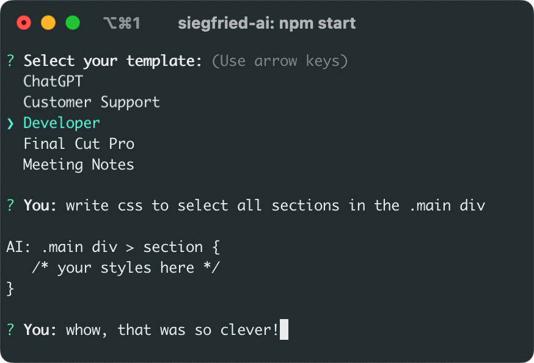

# SiegfriedAI - Your CLI Chat Agents

> Create task specific CLI chat agents with text-based prompt templates.

SiegfriedAI is a Node.js CLI script to interact with OpenAI's GPT-4 API. It's built on the [langchain](https://github.com/langchain-ai/langchainjs) library. Just drop your text files with GPT prompts into the `templates` folder to create your custom chat agents. Happy hacking!

## Table of Contents

- [Install](#install)
- [Usage](#usage)
- [Maintainers](#maintainers)
- [Contributing](#contributing)
- [License](#license)

## Install

Clone the repository:

```bash
git clone https://github.com/steffenbew/siegfried-ai.git
```

Navigate to the project directory and install dependencies:

```bash
cd siegfried-ai
npm install
```

Set your OpenAI API key as an environment variable:

```bash
export OPENAI_API_KEY=your_openai_api_key_here
```

## Usage

Run the chat interface:

```bash
npm start
```

Follow the on-screen prompts to select a template and start chatting.

 

To exit the chat, type `exit`.

Optionally make the script available in any shell, by setting an alias in your `.bashrc` or `.zshrc`:
```bash
alias siegfried='(cd ~/www/siegfried-ai/ && npm start)'
```

### Multiline input

To provide multiline input, press enter to submit an empty input and write your message in a temporary file in your default editor. Submit the text by saving and closing the file.

The default editor can be changed via an environment variable:
```bash
export EDITOR="code -w"
```

For more information see [Inquiry.js#Editor](https://github.com/SBoudrias/Inquirer.js#user-content-editor).

### Context-aware sessions
The script maintains a temporary history of your chat session, which is sent back to OpenAI with every request. This ensures that the agent remains context-aware throughout the conversation, providing more coherent and relevant responses.

Once you close a chat session, the history is dismissed. Each new session starts with a fresh interaction.

### Create your own agents
Create your own chat agents by adding text files with custom prompts in the `templates` directory. The name of the file becomes the agent name which will be provided in the template selection.

#### Example: Code Documentation Helper
Imagine you create a text file named `Code Documentation Helper.txt` in the `templates` directory. This file could contain a prompt like the following:

```
Extend provided code with comments. Use clear and concise language.
```

When you run the script and select `Code Documentation Helper`, you can paste a code snippet. The agent will then generate comments for your code.

## Maintainers
[Steffen Bewersdorff](https://github.com/steffenbew)

## Contributing
To contribute, please use GitHub Issues and PRs.

## License
MIT © 2023 Steffen Bewersdorff