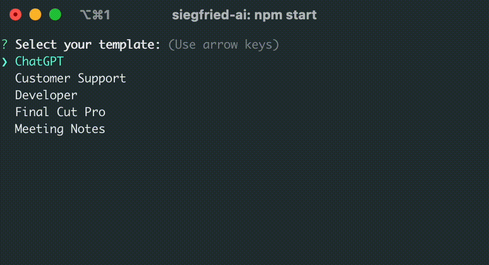

# SiegfriedAI - Your Own ChatGPT Agents

> Create and manage task specific GPT AI agents through text-based prompt templates.

Interact with OpenAI's GPT models from your CLI using prompt-based agents. Simply drop your text files with GPT prompts into the `templates` folder to create your customized chat agents. Use [langchain](https://github.com/langchain-ai/langchainjs) to enhance it further.

 

## :zap: Installation

Clone the repository:

```bash
git clone https://github.com/steffenbew/siegfried-ai.git
```

Navigate to the project directory and install dependencies:

```bash
cd siegfried-ai
npm install
```

Set your OpenAI API key as an environment variable:

```bash
export OPENAI_API_KEY=your_openai_api_key_here
```

Your API key can be found [here](https://platform.openai.com/account/api-keys).

## :rocket: Usage

Run the chat interface:

```bash
npm start
```

Follow the on-screen prompts to select a template and start chatting!

To provide multiline input, open the editor by submitting an empty input.

To return to the template selection, type `exit`.

> [!NOTE]
> __Context-aware sessions:__ The history of your chat session is sent back to OpenAI with every request. This ensures that the agent remains context-aware throughout the conversation to provide coherent responses.
>
> When you exit a chat session, the history is dismissed. Each new session starts with a fresh interaction.

## :art: Customization

Manage your chat agents in the `templates` directory:

```
templates/
├── Customer Support.txt
├── Developer.txt
├── Final Cut Pro.txt
├── Flynt Component.txt
├── Meeting Notes.txt
├── Titles.txt
```

Create a new chat agent by adding a text file with a prompt. The file name will be displayed in the selection.

### Example
1. Create a file named `Code Documentation.txt` in the `templates` directory with the following content:
```
Extend provided code with comments. Use clear and concise language.
```
2. Start the script, and select the template `Code Documentation`.
3. Open the editor, paste a code snippet, and the agent will generate code comments for your code.

# :bulb: Tips
Make the script available in any directory, by setting an alias in your `.bashrc` or `.zshrc`:
```bash
alias siegfried='(cd ~/your/path/siegfried-ai/ && npm start)'
```

The default editor can be changed via an environment variable:
```bash
export EDITOR="code -w"
```

For more information see [Inquiry.js#Editor](https://github.com/SBoudrias/Inquirer.js#user-content-editor).

## Maintainers
[Steffen Bewersdorff](https://github.com/steffenbew)

## Contributing
To contribute, please use GitHub Issues and PRs.

## License
MIT © 2023 Steffen Bewersdorff
